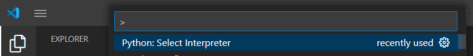
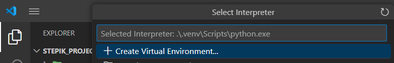
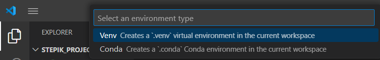
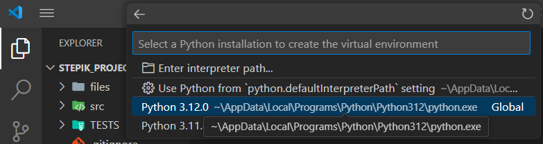
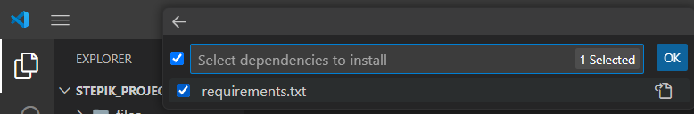

# Проект по предмету "Инженерный практикум" второго курса МФТИ
В данном проекте реализована разработка языка разметки страниц теории и тестов и загрузка страниц на платформу Stepik.

# Содержание
  * [Установка](#установка)
  * [Как пользоваться?](#инструкция-использования)
  * [Используемые библиотеки](#библиотеки)
  * [Авторы](#авторы)

## Установка
1) Если у вас нет Visual Studio Code, рекомендую скачать его. Вы можете это сделать, посмотрев этот видеоролик: https://youtu.be/Re2KdeoRhXY?si=Sr96BpQocTAFAQTT. Вы установите и редактор кода, и Python, а также настроите язык под VScode.
2) Запустите командную строку, перейдите в директорию, в которой вы хотите хранить нашу программу и введите эту команду: 
```
git clone https://github.com/MrWh1teF0x/Stepik_project.git
```
3) Откройте папку с программой с помощью VScode. Зажмите Ctrl+Shift+P, выберите ```Python: Select Interpreter```:

Выберите ```+ Create Virtual Enviroment...```:

Выберите ```Venv```:

Выберите версию Python:

Выберите ```requirements.txt``` и нажмите OK:


Всё! Теперь наша программа готова к работе.

## Инструкция использования
Для начала вам нужно создать файл cred.yaml такого вида: 
```yaml
client_id: ...
client_secret: ...
```
Свои client_id и client_secret вы можете узнать на сайте: https://stepik.org/oauth2/applications/.
Работа с нашей программой производится через интерфейс командной строки. Вам нужно открыть командную строку и выполнять команды в виде:
```python deploy.py [команда] [аргументы] [опции]```
Есть два вида команд: toc и lesson.
### Примеры использования команды toc:
Обязательным аргументом этой команды является путь до файла toc формата yaml. Пример такого файла:
```yaml
title: "Си для начинающих"
course_id: 123455
base_dir: "."
toc:
  1.1:
    path: 'путь_до_файла_1.md'
    lesson_id: 12233131
  1.2:
    path: 'путь_до_файла_2.md'
    lesson_id: 12233132
```
В toc лежат числа с плавающей точкой, в котором за целую часть отвечает номер модуля, а за дробную номер урока. Причём необязательно, чтобы поле lesson_id существовало.
1) ```python deploy.py toc [путь до файла] --all``` - обновляет все уроки из каждого модуля во всем курсе
2) ```python deploy.py toc [путь до файла] -d [номер модуля]``` - обновляет все уроки в модуле
3) ```python deploy.py toc [путь до файла] -d [номер урока]``` - обновляет все шаги в уроке
4) ```python deploy.py toc [путь до файла] -d [номер модуля] -s [номер шага]``` - обновляет определенный шаг в уроке

### Примеры использования команды lesson:
Обязательным аргументом этой команды является путь до файла toc формата markdown.
1) ```python deploy.py lesson [путь до файла] -s [номер шага]``` - обновляет определенный шаг в уроке. В файле обязательно должен быть указан lesson_id
2) ```python deploy.py lesson [путь до файла] --all``` - обновляет все шаги в уроке. В файле обязательно должен быть указан lesson_id
3) ```python deploy.py lesson [путь до файла] --id [id урока]``` - обновляет все шаги в уроке с lesson_id равным id
## Библиотеки
* [click](https://click.palletsprojects.com/en/stable/): для создания интерфейса командной строки
* [markdown](https://python-markdown.github.io/): для работы с файлами формата markdown
* [pyparsing](https://pyparsing-docs.readthedocs.io/en/latest/): для создания парсеров
* [pytest](https://docs.pytest.org/en/latest/): для тестирования
* [pyyaml](https://docs-python.ru/packages/modul-pyyaml-python/): для работы с файлами формата yaml
* [requests](https://pythonru.com/biblioteki/kratkoe-rukovodstvo-po-biblioteke-python-requests): для работы с http-запросами

## Авторы
**[Акрамов Никита](https://github.com/MrWh1teF0x)**
**[Талаев Андрей](https://github.com/ZetroRetro)**